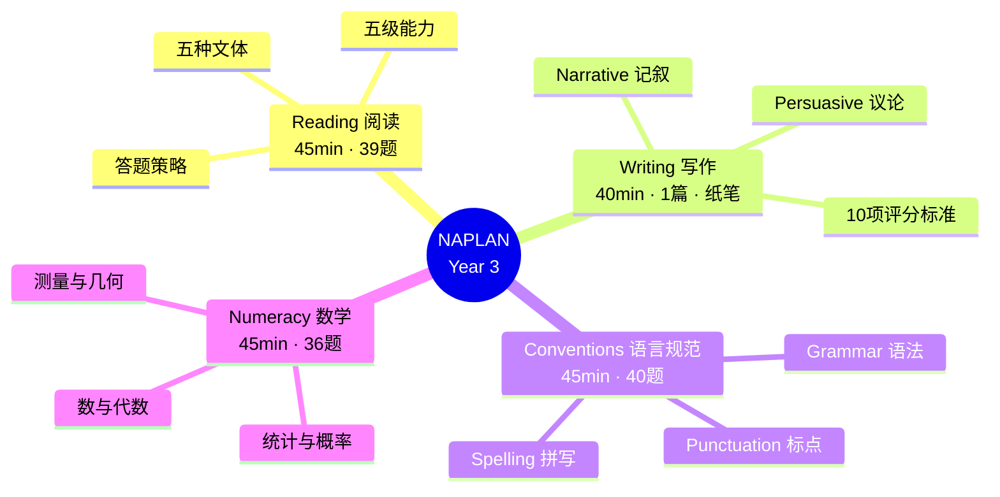
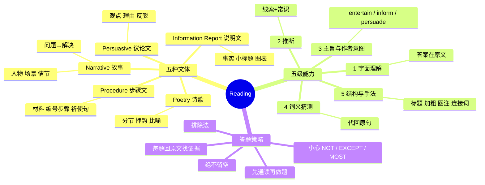
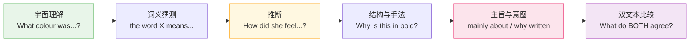
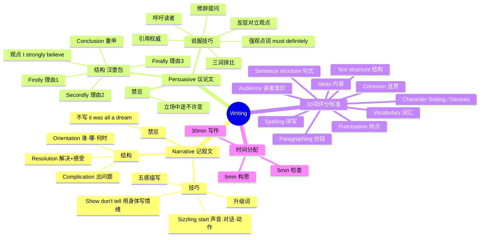
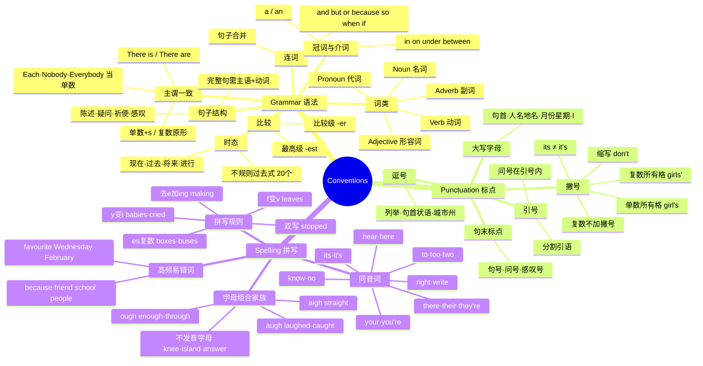
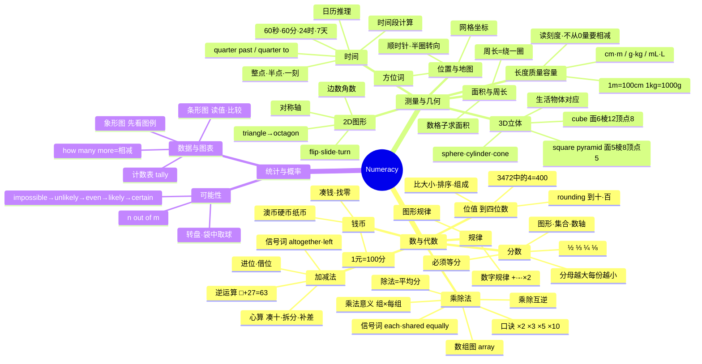

# NAPLAN Year 3 知识框架图

> 五张图：一张总览 + 四科详图。用 mermaid 绘制，在支持 mermaid 的编辑器（VS Code、GitHub、Obsidian）或本资料的交互网页里可直接看图。
> **用法**：贴在书桌前，每学完一个分支就打勾。让 Chloe 自己指着图说"这一块我会了"，比家长反复问更有效。

---

## 图 0 — 四科总览

---

## 图 1 — Reading 阅读

**能力递进关系**（考试里由易到难分布）：

---

## 图 2 — Writing 写作

---

## 图 3 — Conventions of Language 语言规范

---

## 图 4 — Numeracy 数学

---

## 打勾进度表（学完一项打一个勾）

### Reading
- [ ] 认识五种文体 - [ ] 字面理解 - [ ] 推断 - [ ] 主旨与意图 - [ ] 词义猜测 - [ ] 结构与手法 - [ ] 双文本比较

### Writing
- [ ] Narrative 三段结构 - [ ] Sizzling start - [ ] Show don't tell - [ ] Persuasive 汉堡结构 - [ ] 说服技巧≥3种 - [ ] 40分钟内完篇+检查

### Conventions
- [ ] 五类词类 - [ ] 不规则过去式20个 - [ ] 主谓一致 - [ ] 连词与句子合并 - [ ] 大写规则 - [ ] 撇号两用途 - [ ] 引号 - [ ] 拼写五规则 - [ ] ough家族 - [ ] 同音词7组

### Numeracy
- [ ] 位值到四位数 - [ ] 进位借位加减 - [ ] 口诀×2×3×5×10 - [ ] 除法与乘除互逆 - [ ] 分数四种 - [ ] 钱币找零 - [ ] 数列规律 - [ ] 单位换算 - [ ] 读钟面到分钟 - [ ] 2D/3D图形属性 - [ ] 周长面积 - [ ] 图表读图例 - [ ] 可能性五级
